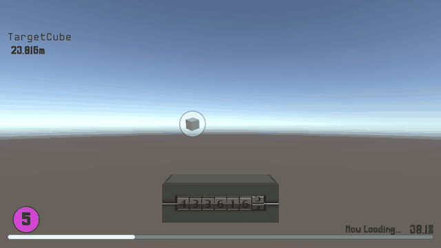
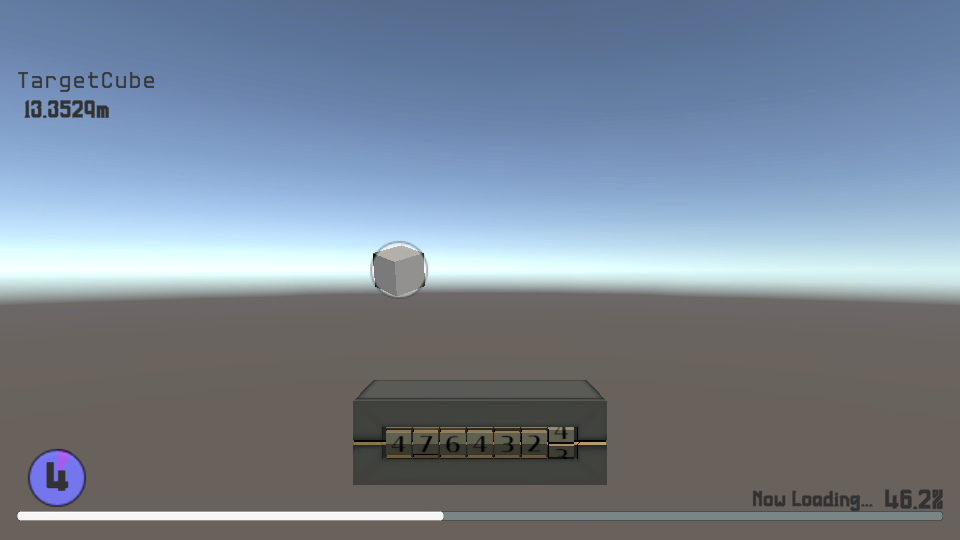
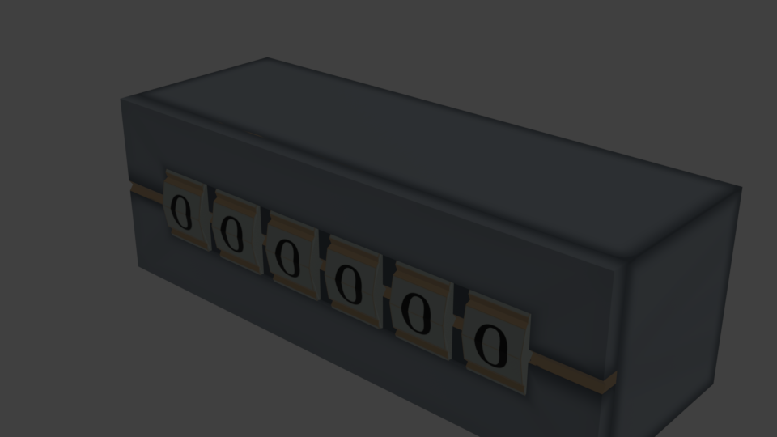

# Meter Assets Workspace

[](https://creativecommons.org/licenses/by/4.0/)

uGUI 向けのメーター UI アセット集。レベルゲージ・進捗ゲージ・回転式（オドメーター型）メーター・ターゲット距離メーターの 4 種を Prefab で収録し、`DemoScene` で動作を確認できます。

A set of meter UI assets for Unity uGUI: level gauge, progress gauge, rotary (odometer-style) meter and target-distance meter, each as a prefab, with a demo scene.

<p align="center">
  
</p>
<p align="center">
  
  
</p>

---

## 動作要件 / Requirements

| | |
| --- | --- |
| Unity | **6000.3.23f1**（Unity 6.3 LTS） |
| Render Pipeline | **URP 17.3.0**（`Assets/Settings/URP_Asset`） |
| UI | uGUI 2.0 ＋ TextMeshPro |
| Blender（原本の編集時のみ） | 5.2 LTS |

---

## 収録物 / Contents

| フォルダ | 内容 |
| --- | --- |
| `Assets/MeterAssets_madebyRadianN/LevelGage/` | レベルゲージ。整数部をレベル、小数部を充填率として表示 |
| `Assets/MeterAssets_madebyRadianN/ProgressGage/` | 進捗ゲージ。0.0〜1.0 をスライダーと百分率で表示 |
| `Assets/MeterAssets_madebyRadianN/RotaryMeter/` | 回転式メーター。桁ごとのローターが繰り上がりつきで回る（モデル・テクスチャ付き） |
| `Assets/MeterAssets_madebyRadianN/TargetDistanceMeter/` | 画面内のターゲットに名前・距離・照準を出す |
| `Assets/MeterAssets_madebyRadianN/Tests/Editor/` | 計算部分の EditMode テスト |
| `Assets/Scenes/DemoScene.unity` | 4 種のデモ |
| `BlenderSources/` | RotaryMeter の Blender 原本（`RotaryMeter.blend`）、テクスチャ原本（`Textures/*.psd`）、FBX 書き出しスクリプト（`export_fbx.py`） |

---

## 使い方 / Usage

各 Prefab をシーンの Canvas（RotaryMeter はワールド空間）に置き、スクリプトから値を渡します。

```csharp
levelGage.SetLevel(3.25f);          // レベル 3・ゲージ 25%
progressGage.SetValue(0.5f);        // 50%（SetPercent(50f) でも可）
rotaryMeter.Value = 123456f;        // 目標値へ滑らかに回る
targetDistanceMeter.SetTarget(go);  // null で追従解除
```

Prefab の見た目（色・フォント・サイズ）は Inspector で差し替えられます。数字は PenchantManufacture、それ以外は x14y24pxHeadUpDaisy を割り当ててあります。

---

## 改造・再生成 / Modifying & regenerating

- RotaryMeter の造形は `BlenderSources/RotaryMeter.blend` を直し、Blender 上で `export_fbx.py` を実行すると FBX とテクスチャが `Assets/` に書き出されます（Blender MCP か `blender --background RotaryMeter.blend --python export_fbx.py`）。
- clone 後はフォントのサブモジュールを取得してください: `git submodule update --init`
- テストは Unity の Test Runner（EditMode）で実行できます。

---

## ライセンス / License

**CC BY 4.0** — 作者制作物（メーターの Prefab・スクリプト・RotaryMeter のモデルとテクスチャ・Blender 原本・デモシーン）はすべて対象です。詳細は [LICENSE](LICENSE)。

Everything authored here (prefabs, scripts, the RotaryMeter model/textures, the Blender source and the demo scene) is CC BY 4.0. See [LICENSE](LICENSE).

クレジット表記例 / Attribution:

```
Meter Assets Workspace by RadianN_kswg / ラジアン（柏木主税） — CC BY 4.0
```

### 第三者の収録物 / Third-party materials

本ライセンスの対象外で、それぞれのライセンスに従います。

| 収録物 | 作者・ライセンス |
| --- | --- |
| x14y24pxHeadUpDaisy（`Assets/Fonts/`・サブモジュール `hicchicc.github.io`） | hicc / 患者長ひっく — [x0y0pxFreeFont](https://hicchicc.github.io/00ff/) 独自ライセンス |
| PenchantManufacture（`Assets/Fonts/`・サブモジュール `PenchantManufacture_ImageAssets`） | RadianN_kswg / ラジアン（柏木主税） — [CC BY 4.0](https://github.com/radiann-kswg/PenchantManufacture_ImageAssets) |
| TextMesh Pro Essential Resources（`Assets/TextMesh Pro/`） | Unity Technologies — Unity Companion License（Liberation Sans: SIL OFL 1.1 / EmojiOne: CC BY 4.0 を含む） |
